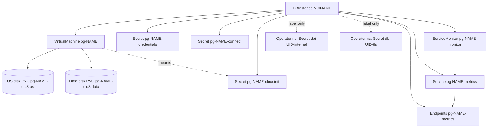

# Managed resources

For a `DBInstance` named `NAME` in namespace `NS` with UID `UID`, the operator creates the objects below. All names
are deterministic and recomputable from the instance, so a lost `status` never orphans anything.

Solid arrows are controller owner references (garbage collection); dotted arrows to the operator namespace are
label-based links, because owner references cannot cross namespaces. The PVCs are created by Harvester from the VM's
volume claim templates, not directly by the operator.

## Tenant namespace objects

| Kind | Name | Created by step | Contents / purpose |
| --- | --- | --- | --- |
| `VirtualMachine` (KubeVirt) | `pg-NAME` | `vm` | Labels `dbaas.opencloud.wso2.com/instance=NAME` and `dbaas.opencloud.wso2.com/role=primary`. CPU and memory from the instance class; one data NIC on the Multus NAD from `spec.networkRef`; run strategy follows `spec.running`. The VMI template carries the instance label so VMI events map back to the owner. Controller-owned. |
| PVC (OS disk) | `pg-NAME-UID8-os` | `vm` (via Harvester) | Cloned from the baked image's storage class. After a repave the name carries a revision suffix; the current name is `status.resources.osDiskPVCName`. `UID8` is the first 8 hex characters of the instance UID, so a recreated instance never reattaches an old disk. |
| PVC (data disk) | `pg-NAME-UID8-data` | `vm` (via Harvester) | Size `spec.allocatedStorage` GiB, storage class `spec.storageType` or `databaseDefaults.storageClass` (default `longhorn`). Grow-only. |
| `Secret` (cloud-init) | `pg-NAME-cloudinit` | `vm` | Keys `userdata` and `networkdata`, read by KubeVirt's cloud-init NoCloud datasource. Contains secrets while bootstrapping; `userdata` is replaced with a no-op cloud-config by `bootstrap-cleanup` once the database is ready. The object is kept, because the running VMI keeps it mounted. Regenerated on repave. |
| `Secret` (credentials) | `pg-NAME-credentials` | `credentials` | Keys `admin_user` and `admin_password`. Generated once, or copied once from your own Secret. See [Credentials](/security/credentials). |
| `Secret` (connection) | `pg-NAME-connect` | `connection-secret` | Password-free: `host`, `port`, `dbname`, `jdbcUrl`, `sslmode` (`verify-ca`), `ca.crt`. Reconciled every pass so the address follows IP changes. See [Connecting](/connecting). |
| `Service` (headless, no selector) | `pg-NAME-metrics` | `monitoring` | Labels `dbaas.opencloud.wso2.com/instance` and `dbaas.opencloud.wso2.com/metrics=true`; port `metrics` 9187/TCP. |
| `Endpoints` | `pg-NAME-metrics` | `monitoring` | Manually binds the Service to the VM's data-network IP (the database is a VM, not a pod). Subsets stay empty until the IP is known. |
| `ServiceMonitor` | `pg-NAME-monitor` | `monitoring` | Selects the metrics Service, port `metrics`, path `/metrics`, labelled `release=prometheus` unless `observability.monitoring.serviceMonitorLabels` says otherwise; scrape interval 15 s unless configured. See [Monitoring](/monitoring). |

All builder-managed objects (cloud-init, connection, Service, Endpoints, ServiceMonitor) also carry the label
`dbaas.opencloud.wso2.com/instance=NAME`. The credentials Secret is created with a controller owner reference.

The metrics endpoint is served by `prometheus-postgres-exporter` inside the VM, which the cloud-init payload
configures to listen on `:9187`. Stopping an instance deactivates the scrape target but keeps the monitoring objects
until deletion.

## Operator namespace objects

Two controller-private Secrets, never exposed to tenants, live in the operator namespace (`POD_NAMESPACE`, usually
`dbaas-system`):

| Secret | Name | Keys | Purpose |
| --- | --- | --- | --- |
| Internal credentials | `dbi-UID-internal` | `repl_password`, `exporter_password` | Passwords for internal database roles (the exporter role is granted `pg_monitor`). |
| TLS | `dbi-UID-tls` | `ca.crt`, `ca.key`, server cert and key | Per-instance CA and server certificate. Only the CA certificate is published to tenants, in the connection Secret. |

Both carry labels `dbaas.opencloud.wso2.com/instance` and `dbaas.opencloud.wso2.com/dbinstance-uid`. They are
recorded in `status.resources.internalSecretRef` and `privateTLSSecretRef` as `namespace/name`.

## Where the operator records what it made

`status.resources` holds: `nadName`, `dataVolumeName`, `osDiskPVCName`, `pendingDeleteOSDiskPVCName` (during a
repave), `vmName`, `adminCredentialsSecretName`, `cloudInitSecretName`, `serviceMonitor`, `metricsServiceName`,
`connectionSecretName`, `internalSecretRef` and `privateTLSSecretRef`. The finalizer's teardown reads these refs.
Fields that can be observed from the live cluster (VM name, disk names) are re-recorded on each pass, so
`status.resources` self-heals.

## Garbage collection and deletion

1. The finalizer `dbaas.opencloud.wso2.com/cleanup` runs `TeardownAll`, which explicitly deletes the
   `ServiceMonitor`, `Endpoints`, metrics `Service`, `VirtualMachine`, and the three tenant Secrets, then removes the
   operator-namespace Secrets, then releases the finalizer.
2. Controller owner references on same-namespace children let Kubernetes garbage collection remove anything left over.
3. Objects you supplied are never deleted: the NAD, the Harvester image, and a password Secret referenced by
   `spec.credentials.passwordSource`.
4. The data and OS disk PVCs are not deleted by the operator. Check `kubectl get pvc -n NS` after deletion; this
   behaviour is not verified in the code.

:::info Verified against
`database/internal/resource/builder.go`, `database/internal/resource/cloudinit_secret.go`,
`database/internal/resource/connection_secret.go`, `database/internal/resource/metrics_service.go`,
`database/internal/resource/metrics_endpoints.go`, `database/internal/resource/servicemonitor.go`,
`database/internal/credentials/resolver.go`, `database/internal/credentials/cloudinit.go`,
`database/internal/ensure/vm.go`, `database/internal/ensure/monitoring.go`,
`database/internal/ensure/bootstrap_cleanup.go`, `database/internal/harvester/typed_client.go`,
`database/internal/controller/dbinstance_controller.go`, `database/api/v1alpha1/dbinstance_types.go`,
`database/CREDENTIALS.md`.
:::
