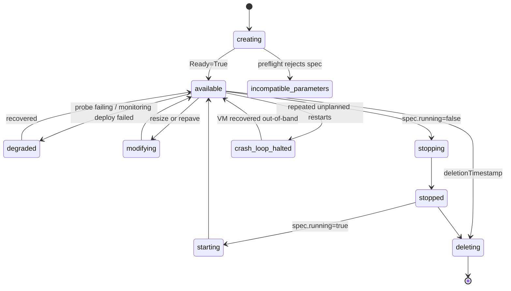

# Architecture overview

The operator is a single controller-runtime manager (`cmd/main.go`) that reconciles `DBInstance` resources. It talks
to the Kubernetes API for ordinary objects and, through a small Harvester client abstraction, to KubeVirt and
Harvester APIs for the VM.

## Components

**Controller** (`internal/controller`). `DBInstanceReconciler.Reconcile` loads the `DBInstance`, handles deletion
through a finalizer, adds the finalizer on first sight, and otherwise runs the ensure runner. A deferred function
derives the aggregate conditions and `status.phase` and patches status once per pass.

**Ensure runner** (`internal/ensure`). An ordered list of idempotent steps. Each step re-observes real state and
returns one of four outcomes; the runner stops at the first step that is not satisfied. See
[Reconcile pipeline](/architecture/reconcile-pipeline).

**Resource builders** (`internal/resource`). Small `Build`/`Update` pairs applied with `CreateOrUpdate` and a
controller owner reference, for owned declarative children: the cloud-init Secret, connection Secret, metrics
`Service`, `Endpoints` and `ServiceMonitor`. The VM itself is not built here; it belongs to the Harvester client.

**Credentials resolver** (`internal/credentials`). Generates (once) or accepts the master password, generates the
per-instance TLS material, and renders the cloud-init payload that bootstraps PostgreSQL in the VM.

**Baked image catalog** (`internal/catalog`). A registry compiled into the binary mapping OS stream (for example
`22.04`) to a validated image revision and the PostgreSQL major versions it supports.

**Harvester client** (`internal/harvester`). See below.

**REST gateway** (`internal/gateway`). Optional HTTP front end (`/healthz`, `/dbinstances`, `/dbinstances/{name}`
and sub-routes). It builds a per-request client from the caller's bearer token, so Kubernetes enforces authn, authz
and audit. Mutations return `202 Accepted`; poll `GET /dbinstances/{name}` for status.

## The Harvester client abstraction

`harvester.ClientInterface` is the only contract the controller uses for Harvester-specific work, so Harvester API
types never leak into reconcile logic. The production implementation is `TypedClient` (typed Harvester and KubeVirt
clientsets). The interface covers:

| Group | Methods |
| --- | --- |
| Images | `ResolveVMImage`, `ResolveVMImageDisplayName` |
| VM create | `CreatePostgresVM` (idempotent; consumes an already-created cloud-init Secret) |
| Power | `StartVM`, `StopVM`, `StopVMForCrashLoop`, `ClearCrashLoopHalt` |
| Shape | `ResizeVM`, `ResizeDataVolume` |
| OS disk / repave | `SwapVMOSDisk`, `DeletePVC`, `GetVMOSDiskImageID`, `GetVMOSDiskPVCName` |
| Health | `GetVMIReadiness` (running, data-net IP, ready, guest-agent connected, VMI UID) |
| Delete | `TeardownAll` |

Semantic errors (`ErrVMImageNotFound`, `ErrVMImageNotReady`, `ErrVMImageAmbiguous`,
`ErrVMImageReferenceInvalid`) let preflight choose between a terminal failure and a timed retry without parsing
strings.

## Watches

The controller is registered with `For(DBInstance)` plus:

| Watch | Mechanism | Purpose |
| --- | --- | --- |
| `Secret`, `Service`, `Endpoints`, `VirtualMachine`, `ServiceMonitor` | `Owns()` | Drift on a child (for example a deleted Secret) re-triggers reconcile of its owner. |
| `VirtualMachineInstance` | `Watches()` mapped by the `dbaas.opencloud.wso2.com/instance` label | VMIs are owned by the VM, not the `DBInstance`, so they are mapped by label. A predicate only passes create/delete, UID change, phase change, `Ready` or `AgentConnected` flips, and interface IP changes. |

Steady state is event driven: a pass in which every step is satisfied writes nothing and requeues nothing. Timed
requeues are used only while waiting (for example 10 s for an image still importing, 5 s while credentials are
observed, 30 s while a user password Secret is missing). `maxConcurrentReconciles` defaults to 1.

Secrets the user may fix (your own password Secret) are not watched, which is why the credentials step polls.

## Finalizer and ownership

- Finalizer: `dbaas.opencloud.wso2.com/cleanup`, added before any child is created.
- Same-namespace children carry a controller owner reference to the `DBInstance`, so Kubernetes garbage collection
  backs up the finalizer's explicit teardown.
- Two controller-private Secrets live in the **operator namespace**, where owner references are not allowed. They
  are tracked by `status.resources.internalSecretRef`/`privateTLSSecretRef` and by the label
  `dbaas.opencloud.wso2.com/dbinstance-uid`, and the finalizer sweeps them by that label.

Details of each object are on [Managed resources](/architecture/managed-resources).

## Phase state machine (high level)

`status.phase` is never set directly by steps. It is always derived from conditions by `DerivePhaseSummary`, first
match wins:

Precedence as implemented: `deleting`, `crash-loop-halted`, `incompatible-parameters` (current-generation
`Accepted=False`), `stopping`/`stopped` (when `spec.running` is false), `degraded`, `modifying` (resize or repave
in progress), `degraded` (monitoring deploy failed on an otherwise ready database), `starting`, `available`, and
`creating` as the default. The full condition catalogue is in
[Status and conditions](/reference/status-and-conditions).

The phase `failed` exists as a constant but `DerivePhaseSummary` never returns it.

:::info Verified against
`database/cmd/main.go`, `database/internal/controller/dbinstance_controller.go`,
`database/internal/controller/watches.go`, `database/internal/controller/status_conditions.go`,
`database/internal/harvester/interface.go`, `database/internal/harvester/typed_client.go`,
`database/internal/gateway/gateway.go`, `database/internal/resource/builder.go`,
`database/api/v1alpha1/dbinstance_conditions.go`, `database/api/v1alpha1/dbinstance_types.go`,
`database/internal/config/defaults.go`.
:::
