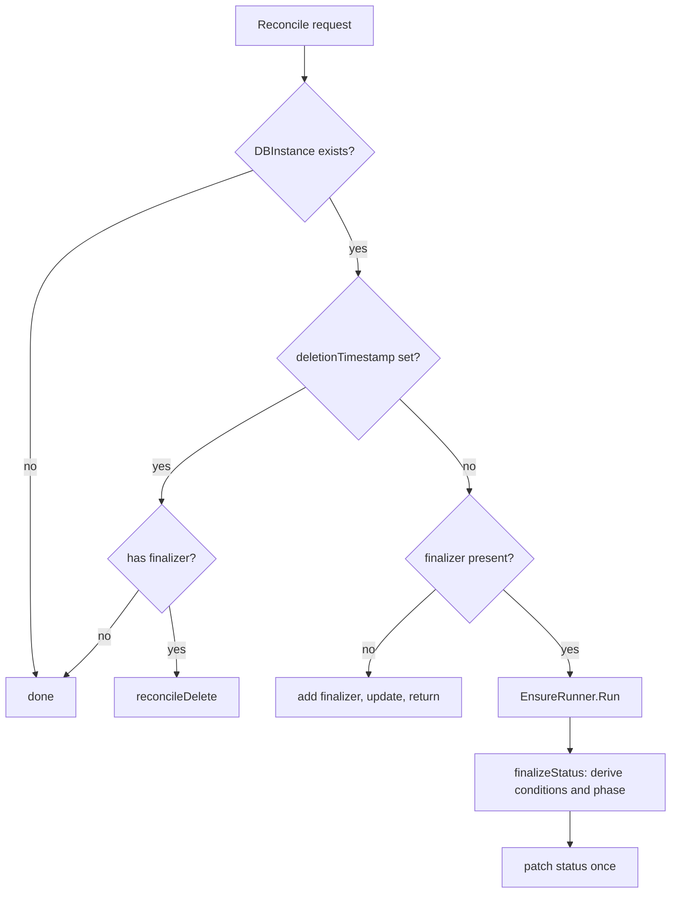
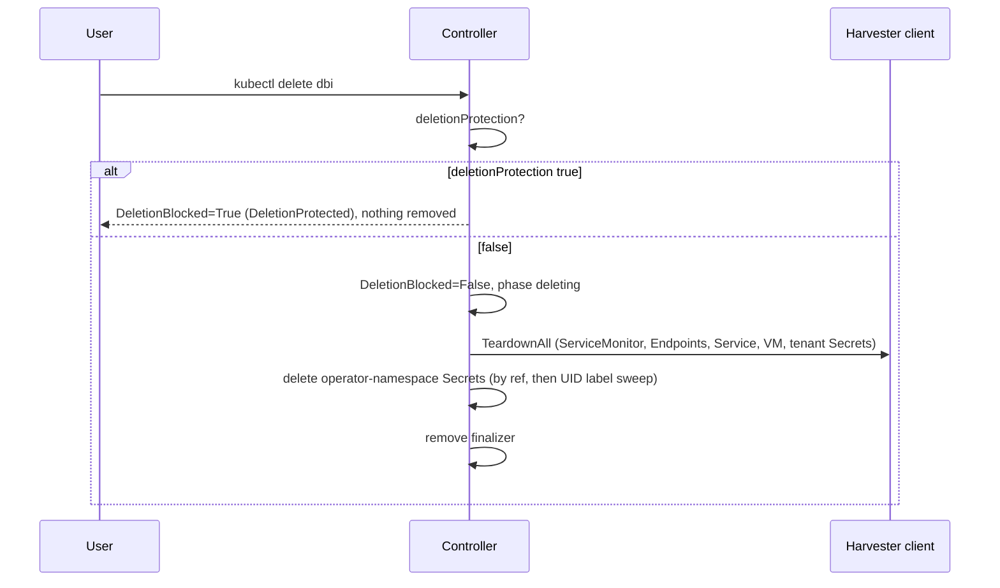

# Reconcile pipeline

Every `DBInstance`, in every state (provisioning, steady state, stopped, crash-loop parked), runs the same bounded
chain of ensure steps. There is no separate code path for "create" versus "update".

## Reconcile entry

Adding the finalizer updates the object, which produces a watch event, so no explicit requeue is needed.

## Step outcomes

Each step returns a `Result`:

| Outcome | Meaning | Runner behaviour |
| --- | --- | --- |
| `Satisfied` | Observed state matches desired. | Continue to the next step. |
| `Pending` | Waiting for something; optionally `RequeueAfter`. Without a timer, the next watch event or status write re-triggers. | Stop the pass. |
| `Terminal` | The spec cannot be satisfied as written (for example unknown class). Requires a user fix. | Stop the pass; condition explains why. |
| `Transient` | An error; controller-runtime retries with backoff. | Stop the pass. |

Steps that create or update an object return `Pending` so that the next pass re-observes the persisted object before
anything depends on it.

## Step order

`NewDefaultSteps` in `internal/ensure/runner.go` defines the order:

| # | Step | What it does |
| --- | --- | --- |
| 1 | `preflight` | Validates `dbInstanceClass` against the instance-class table (`InvalidClass`), requires `spec.networkRef` (`NetworkRefMissing`), rejects `spec.vmPassword` on new instances when `security.rejectVMPassword` is on (`VMPasswordNotAllowed`), rejects edits to immutable fields (`ImmutableFieldChanged`). For a never-provisioned instance it also resolves the baked image for the configured OS stream, checks `engineVersion` is supported by it, and checks the Harvester image exists and is ready (`OSImageInvalid`, `OSImageNotFound`; a still-importing image is `Pending`, retried every 10 s). Sets `PreflightReady`. |
| 2 | `credentials` | Resolves durable credential and TLS material, creating the three Secrets at most once. Creation returns `Pending` (5 s) so the next pass observes them. A missing source or lost Secret polls every 30 s. Sets `CredentialsReady`. |
| 3 | `vm` | If the `VirtualMachine` is absent (including after an out-of-band delete), renders cloud-init, applies the cloud-init Secret, and calls `CreatePostgresVM`. Records `status.appliedSpec` and `status.currentImageRevision`. Returns `Pending` after create. Sets `VMReady`. |
| 4 | `resize` | Cold resize when the VM's declared CPU/memory or data-disk size differs from the class and `spec.allocatedStorage`: halt, apply, let `power` restart. |
| 5 | `repave` | Reports `ImageDrift` every pass; applies a repave when the `dbaas.opencloud.wso2.com/repave-trigger` annotation differs from `status.lastAppliedRepaveTrigger`. |
| 6 | `power` | Converges VM run state onto `spec.running` (default `true`). Refuses to start a VM that is crash-loop halted. Sets `PowerStateReady`. |
| 7 | `health` | Reads one VMI snapshot: boot gate, PostgreSQL readiness, crash-loop guard, and steady-state liveness. Publishes `status.endpoint`. Sets `DatabaseReady`, `Degraded`, `CrashLoopHalted`. |
| 8 | `connection-secret` | Waits for `status.endpoint`, then applies the tenant connection Secret. |
| 9 | `monitoring` | Applies the metrics `Service`, `Endpoints` and `ServiceMonitor` while the instance is meant to run. Sets `MonitoringReady`. |
| 10 | `bootstrap-cleanup` | Once `DatabaseReady` is true, redacts `userdata` in the cloud-init Secret (see [Managed resources](/architecture/managed-resources)). |
| 11 | `generation-reconciled` | Only when every earlier step was satisfied: advances `status.observedGeneration`. |

`resize` and `repave` are ordered before `power` so they never fight over VM power state, and before `health` so a
deliberate halt is reported rather than seen as a failure. Resize and repave are described in
[Resize and power](/operations/resize-and-power) and [Images and repave](/operations/images-and-repave).

### Health semantics

The `health` step is both the provisioning gate and the liveness monitor:

- While `observedGeneration` is behind `generation` it **gates**: a booting VM or a failing readiness probe returns
  `Pending` with a 10 s requeue (the VMI watch also wakes the controller).
- Once caught up, a probe failure is **report only**: `Degraded=True` and phase `degraded`. The controller never
  restarts a VM because of a failed probe.
- The only controller-initiated halt is the **crash-loop guard**: repeated unplanned restarts (a changing VMI UID;
  live migration preserves the UID) halt the VM and set `CrashLoopHalted`. It re-probes while parked and recovers
  automatically when an administrator starts the VM out-of-band and it becomes healthy.
- If the instance is stopped, `DatabaseReady=False` with reason `Stopped` and the step is satisfied.

## Deletion

`TeardownAll` deletes the recorded objects in parallel and treats NotFound as success; any other error becomes
`DeletionBlocked` with reason `TeardownFailed` and is retried. The operator-namespace Secrets are deleted by their
recorded reference and then by a sweep on the `dbaas.opencloud.wso2.com/dbinstance-uid` label. Only after both
succeed is the finalizer removed. The data and OS disk PVCs are not deleted by the operator; whether Harvester
removes them with the VM is not verified by the code. See
[Lifecycle and deletion](/operations/lifecycle-and-deletion).

:::info Verified against
`database/internal/ensure/runner.go`, `database/internal/ensure/step.go`, `database/internal/ensure/result.go`,
`database/internal/ensure/preflight.go`, `database/internal/ensure/credentials.go`,
`database/internal/ensure/vm.go`, `database/internal/ensure/resize.go`, `database/internal/ensure/repave.go`,
`database/internal/ensure/power.go`, `database/internal/ensure/health.go`,
`database/internal/ensure/connection_secret.go`, `database/internal/ensure/monitoring.go`,
`database/internal/ensure/bootstrap_cleanup.go`, `database/internal/ensure/generation.go`,
`database/internal/controller/dbinstance_controller.go`, `database/internal/harvester/typed_client.go`,
`database/CREDENTIALS.md`.
:::
