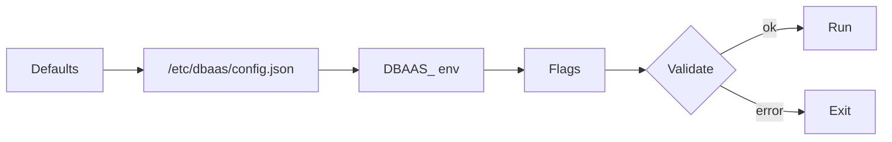

# Operator configuration

The manager loads one typed configuration with [`nil-go/konf`](https://github.com/nil-go/konf). Every key has a built-in default, so the operator starts with no file at all.

## Sources and precedence

From lowest to highest:

```text
built-in defaults < config file < environment variables < explicit flags
```



- **File.** Only the fixed path `/etc/dbaas/config.json` is read, and only if it exists. There is no flag or environment variable to choose another path. A file that exists but cannot be parsed is a startup error. Keys use the camelCase names in the tables below, nested as JSON objects.
- **Environment.** Variables start with `DBAAS_`; `__` separates hierarchy levels and a single `_` separates words inside one key, converted to lowerCamelCase. Example: `DBAAS_CONTROLLER__MAX_CONCURRENT_RECONCILES=4` is `controller.maxConcurrentReconciles`; `DBAAS_SECURITY__REJECT_VM_PASSWORD=true` is `security.rejectVMPassword`. An empty segment makes the variable ignored.
- **Flags.** Dotted paths such as `--controller.maxConcurrentReconciles=4`. Only flags you pass explicitly override lower sources, so passing a value equal to its default still wins over a file or environment value.
- **Restart required.** Configuration is read once at startup; live reload is not implemented.
- **Validation.** After merging, the whole configuration is validated; any failure stops the manager with `validate configuration: ...`.
- **Rejected key.** `operator.namespace` in any source fails startup, because the namespace is taken from the `POD_NAMESPACE` environment variable (Downward API), which is required.

Example file:

```json
{
  "operator": { "leaderElection": { "enabled": true } },
  "databaseDefaults": { "osVersion": "24.04", "storageClass": "longhorn" },
  "security": { "rejectVMPassword": true }
}
```

How to deliver the file or flags: kustomize uses the overlay ConfigMap ([Kustomize](/installation/kustomize)); the Helm chart sets flags through `manager.args` and environment through `manager.env` or `manager.envOverrides` ([Helm values](/configuration/helm-values)). The chart has no value that mounts a config file by itself; `manager.extraVolumes` and `manager.extraVolumeMounts` are supported by the template for that purpose.

## Reference

Environment names are derived by the rule above. A dash in the Flag column means no flag is registered.

### operator and controller

| Key | Type | Default | Flag | Env | Validation |
| --- | --- | --- | --- | --- | --- |
| `operator.leaderElection.enabled` | bool | `false` | `--operator.leaderElection.enabled` | `DBAAS_OPERATOR__LEADER_ELECTION__ENABLED` | none |
| `operator.leaderElection.id` | string | `734f9ee3.opencloud.wso2.com` | `--operator.leaderElection.id` | `DBAAS_OPERATOR__LEADER_ELECTION__ID` | non-blank when leader election is enabled |
| `controller.maxConcurrentReconciles` | int | `1` | `--controller.maxConcurrentReconciles` | `DBAAS_CONTROLLER__MAX_CONCURRENT_RECONCILES` | at least 1 |

The built-in default for leader election is off, but both the chart and the kustomize Deployment pass `--operator.leaderElection.enabled=true`.

### server

| Key | Type | Default | Flag | Env | Validation |
| --- | --- | --- | --- | --- | --- |
| `server.enableHTTP2` | bool | `false` | `--server.enableHTTP2` | `DBAAS_SERVER__ENABLE_HTTP2` | none |
| `server.health.bindAddress` | string | `:8081` | `--server.health.bindAddress` | `DBAAS_SERVER__HEALTH__BIND_ADDRESS` | `host:port`, port 1-65535, non-empty |
| `server.gateway.enabled` | bool | `true` | `--server.gateway.enabled` | `DBAAS_SERVER__GATEWAY__ENABLED` | none |
| `server.gateway.bindAddress` | string | `:8080` | `--server.gateway.bindAddress` | `DBAAS_SERVER__GATEWAY__BIND_ADDRESS` | validated only when the gateway is enabled; `host:port` |
| `server.gateway.defaultNamespace` | string | `default` | `--server.gateway.defaultNamespace` | `DBAAS_SERVER__GATEWAY__DEFAULT_NAMESPACE` | validated only when enabled; DNS-1123 label |
| `server.webhook.tls.certDir` | string | empty | `--server.webhook.tls.certDir` | `DBAAS_SERVER__WEBHOOK__TLS__CERT_DIR` | none |
| `server.webhook.tls.certFile` | string | `tls.crt` | `--server.webhook.tls.certFile` | `DBAAS_SERVER__WEBHOOK__TLS__CERT_FILE` | non-empty when `certDir` is set |
| `server.webhook.tls.keyFile` | string | `tls.key` | `--server.webhook.tls.keyFile` | `DBAAS_SERVER__WEBHOOK__TLS__KEY_FILE` | non-empty when `certDir` is set |

`server.enableHTTP2=false` makes the manager disable HTTP/2 on its servers. The health listener serves `/healthz` and `/readyz` and backs the Deployment probes on port 8081. The gateway is an HTTP REST endpoint (`/healthz`, `/dbinstances`, `/dbinstances/...`) that forwards the caller's bearer token to the API server; it is on by default.

:::note
The operator registers no admission or conversion webhooks in this release. The `server.webhook.tls.*` keys only configure the webhook server's certificate location in `cmd/main.go`.
:::

### infrastructure

| Key | Type | Default | Flag | Env | Validation |
| --- | --- | --- | --- | --- | --- |
| `infrastructure.harvester.managementLogicalSwitch` | string | `ovn-default` | `--infrastructure.harvester.managementLogicalSwitch` | `DBAAS_INFRASTRUCTURE__HARVESTER__MANAGEMENT_LOGICAL_SWITCH` | none |
| `infrastructure.harvester.imageNamespace` | string | `default` | `--infrastructure.harvester.imageNamespace` | `DBAAS_INFRASTRUCTURE__HARVESTER__IMAGE_NAMESPACE` | DNS-1123 label (so cannot be empty) |

`managementLogicalSwitch` is the Kube-OVN logical switch for VM launcher management networking. `imageNamespace` is where baked-image names without a `namespace/name` prefix are resolved.

### databaseDefaults

| Key | Type | Default | Flag | Env | Validation |
| --- | --- | --- | --- | --- | --- |
| `databaseDefaults.storageClass` | string | `longhorn` | `--databaseDefaults.storageClass` | `DBAAS_DATABASE_DEFAULTS__STORAGE_CLASS` | non-empty |
| `databaseDefaults.masterUsername` | string | `dbadmin` | `--databaseDefaults.masterUsername` | `DBAAS_DATABASE_DEFAULTS__MASTER_USERNAME` | non-empty |
| `databaseDefaults.port` | int | `5432` | `--databaseDefaults.port` | `DBAAS_DATABASE_DEFAULTS__PORT` | 1-65535 |
| `databaseDefaults.osVersion` | string | `22.04` | `--databaseDefaults.osVersion` | `DBAAS_DATABASE_DEFAULTS__OS_VERSION` | non-blank |

`osVersion` is the catalog stream key (`22.04` or `24.04` in this release), platform-wide with no per-instance override. Validation accepts any non-blank string, but an unknown or unvalidated stream makes every new instance fail preflight with `OSImageInvalid`. See [Prerequisites](/installation/prerequisites).

### observability

| Key | Type | Default | Flag | Env | Validation |
| --- | --- | --- | --- | --- | --- |
| `observability.grafana.baseURL` | string | `https://grafana.monitoring.svc` | `--observability.grafana.baseURL` | `DBAAS_OBSERVABILITY__GRAFANA__BASE_URL` | empty allowed; otherwise absolute URL with scheme and host |
| `observability.metrics.bindAddress` | string | `0` (disabled) | `--observability.metrics.bindAddress` | `DBAAS_OBSERVABILITY__METRICS__BIND_ADDRESS` | `0` or `host:port` |
| `observability.metrics.secure` | bool | `true` | `--observability.metrics.secure` | `DBAAS_OBSERVABILITY__METRICS__SECURE` | none |
| `observability.metrics.tls.certDir` | string | empty | `--observability.metrics.tls.certDir` | `DBAAS_OBSERVABILITY__METRICS__TLS__CERT_DIR` | none |
| `observability.metrics.tls.certFile` | string | `tls.crt` | `--observability.metrics.tls.certFile` | `DBAAS_OBSERVABILITY__METRICS__TLS__CERT_FILE` | non-empty when `certDir` set |
| `observability.metrics.tls.keyFile` | string | `tls.key` | `--observability.metrics.tls.keyFile` | `DBAAS_OBSERVABILITY__METRICS__TLS__KEY_FILE` | non-empty when `certDir` set |
| `observability.monitoring.scrapeInterval` | duration | `15s` | `--observability.monitoring.scrapeInterval` | `DBAAS_OBSERVABILITY__MONITORING__SCRAPE_INTERVAL` | greater than zero |
| `observability.monitoring.serviceMonitorLabels` | map of string to string | `{release: prometheus}` | - | - | none |

`grafana.baseURL` builds the per-instance Grafana links. `scrapeInterval` and `serviceMonitorLabels` configure the per-instance `ServiceMonitor` (labels must match your Prometheus selector). Set `serviceMonitorLabels` in the config file; map keys are case sensitive, so environment variables are not a reliable way to set it. When secure serving is on and no `certDir` is set, controller-runtime serves a self-generated certificate. See [Monitoring](/monitoring).

### logging

| Key | Type | Default | Flag | Env | Validation |
| --- | --- | --- | --- | --- | --- |
| `logging.development` | bool | `false` | `--logging.development` | `DBAAS_LOGGING__DEVELOPMENT` | none |
| `logging.encoder` | string | `json` | `--logging.encoder` | `DBAAS_LOGGING__ENCODER` | `json` or `console` |
| `logging.level` | string | `info` | `--logging.level` | `DBAAS_LOGGING__LEVEL` | `debug`, `info`, `warn`, `error`, `panic` |
| `logging.stacktraceLevel` | string | `error` | `--logging.stacktraceLevel` | `DBAAS_LOGGING__STACKTRACE_LEVEL` | same set as `level` |
| `logging.timeEncoding` | string | `rfc3339` | `--logging.timeEncoding` | `DBAAS_LOGGING__TIME_ENCODING` | `epoch`, `millis`, `nano`, `iso8601`, `rfc3339`, `rfc3339nano` |

### security

| Key | Type | Default | Flag | Env |
| --- | --- | --- | --- | --- |
| `security.rejectVMPassword` | bool | `false` | `--security.rejectVMPassword` | `DBAAS_SECURITY__REJECT_VM_PASSWORD` |

See [Policy switches](/configuration/policy-switches).

### instanceClasses

A map from class name to `cpuCores`, `memoryMB` and `maxConnections`. It has no flag. The default is the compiled-in catalog:

| Class | CPU cores | Memory (MB) | Max connections |
| --- | --- | --- | --- |
| `db.t3.micro` | 1 | 1024 | 50 |
| `db.t3.small` | 1 | 2048 | 100 |
| `db.t3.medium` | 2 | 4096 | 150 |
| `db.t3.large` | 2 | 8192 | 200 |
| `db.t3.xlarge` | 4 | 16384 | 300 |
| `db.m5.large` | 2 | 8192 | 200 |
| `db.m5.xlarge` | 4 | 16384 | 400 |
| `db.m5.2xlarge` | 8 | 32768 | 600 |
| `db.m5.4xlarge` | 16 | 65536 | 1000 |
| `db.r5.large` | 2 | 16384 | 300 |
| `db.r5.xlarge` | 4 | 32768 | 500 |
| `db.r5.2xlarge` | 8 | 65536 | 800 |

Validation: at least one class; no blank name; every class needs `cpuCores`, `memoryMB` and `maxConnections` each at least 1. A `DBInstance` whose `dbInstanceClass` is not in the map fails preflight with `InvalidClass`. Class names contain dots, so define the map in the config file rather than through environment variables. How a file-supplied map merges with the built-in defaults (replace versus per-key merge) was not confirmed in the code; include every class you need.

See [DBInstance spec](/reference/dbinstance-spec) for how instances select a class.

:::info Verified against
- `internal/config/types.go`, `defaults.go`, `flags.go`, `load.go`, `validate.go`, `namespace.go`
- `internal/config/load_test.go`
- `api/v1alpha1/dbinstance_types.go` (`InstanceClasses`)
- `cmd/main.go`
- `internal/gateway/gateway.go`
- `config/overlays/operator-config/*`, `charts/chart/templates/manager/manager.yaml`
:::
