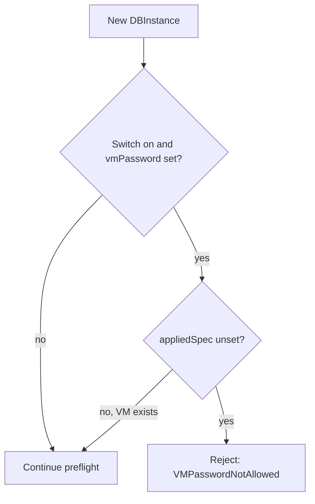

# Policy switches

Policy switches live under the `security` key. They are platform-wide, tighten what a `DBInstance` may request, and every switch defaults to off, so enabling one is an explicit operator decision. This release has one switch.

## `security.rejectVMPassword`

| | |
| --- | --- |
| Type | bool |
| Default | `false` |
| Flag | `--security.rejectVMPassword=true` |
| Env | `DBAAS_SECURITY__REJECT_VM_PASSWORD=true` |
| File | `{"security": {"rejectVMPassword": true}}` |

`spec.vmPassword` enables password login (console and SSH) for the VM's OS user. It is intended for development; production platforms normally do not want it.

### What the code does

In the preflight step the operator rejects an instance when all three hold:

1. the switch is on,
2. `spec.vmPassword` is non-empty, and
3. the VM has never been created (`status.appliedSpec` is unset, the same "never provisioned" test the OS-image checks use).

The result is:

- condition `PreflightReady=False` with reason `VMPasswordNotAllowed`, and a terminal result (no retry timer; nothing is created);
- the message `spec.vmPassword is set, but this platform does not allow password login to the VM (security.rejectVMPassword). Remove spec.vmPassword and recreate the DBInstance`. The value itself is never echoed.

This check runs after the instance-class and `networkRef` checks and before the immutable-field and image checks.



### What it does not do

- Instances whose VM already exists are never affected. `vmPassword` is immutable, so they keep what they were created with, and a repave or an out-of-band VM rebuild reproduces the same VM.
- It does not strip or change the field on stored objects.
- With the switch on, new instances have no console or SSH login through the operator (no password and no injected key). Plan your access path in advance; see [TLS and access](/security/tls-and-access) and [Credentials](/security/credentials).
- An existing instance can drop `vmPassword` only by being recreated; take a `pg_dump` first.

### Enabling it

Helm or Addon (repeat the default args, since lists replace):

```yaml
manager:
  args:
    - --operator.leaderElection.enabled=true
    - --observability.metrics.bindAddress=:8443
    - --security.rejectVMPassword=true
```

Kustomize overlay: set `"security": {"rejectVMPassword": true}` in `operator_config.yaml`.

Check that it is active:

```sh
kubectl get deployment dbaas-operator-controller-manager -n dbaas-system \
  -o jsonpath='{.spec.template.spec.containers[0].args}'
```

The default is off, so production installs should turn it on.

:::info Verified against
- `internal/config/types.go` (`SecurityConfig`), `defaults.go`, `flags.go`
- `internal/ensure/preflight.go` (`vmPasswordRejected`)
- `internal/config/load_test.go`
- `cmd/main.go`
- `INSTALL.md` (production hardening section)
:::
