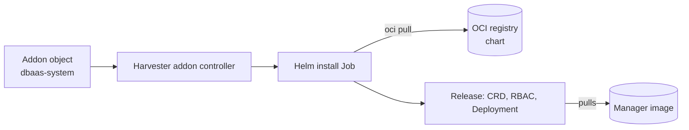

# Helm chart and Harvester Addon

The chart at `database/charts/chart/` (name `dbaas-operator`) installs the CRD, RBAC, the manager Deployment and an optional metrics Service and `ServiceMonitor`. A Harvester `Addon` is a thin wrapper that makes Harvester run `helm upgrade --install` for you.



The chart and the manager image are two separate OCI packages. The Addon `chart:` field fetches only the chart; the image comes from `manager.image.repository` and defaults to `ghcr.io/wso2/dbaas-operator:<appVersion>`.

:::warning Registry availability
The chart default points at `ghcr.io/wso2/dbaas-operator`. `INSTALL.md` records that write access to the WSO2 namespace was not yet confirmed. Until it exists the default image cannot be pulled; use the testing flow below.
:::

## Option 1: Harvester Addon

Apply an Addon manifest (template in `deploy/harvester-addon/dbaas-operator/dbaas-operator.yaml`):

```yaml
apiVersion: v1
kind: Namespace
metadata:
  name: dbaas-system
---
apiVersion: harvesterhci.io/v1beta1
kind: Addon
metadata:
  name: dbaas-operator
  namespace: dbaas-system
  labels:
    addon.harvesterhci.io/experimental: "true"
spec:
  enabled: true
  repo: ""
  chart: oci://REGISTRY/charts/dbaas-operator
  version: X.Y.Z
  valuesContent: |-
    {}
```

- `repo: ""` must be present: the Addon schema requires the key, but `helm repo add` does not understand `oci://`, so it is left empty and the pull happens through `chart`.
- The `experimental` label is what allows the Addon object to be deleted later.
- Replace `REGISTRY` and `X.Y.Z` with your chart location and version. The chart in the repository is `0.1.0-experiment.2` (`Chart.yaml`).

Verify:

```sh
kubectl get addon dbaas-operator -n dbaas-system -o jsonpath='{.status.status}{"\n"}'   # AddonDeploySuccessful
kubectl get pods -n dbaas-system
kubectl get deployment dbaas-operator-controller-manager -n dbaas-system \
  -o jsonpath='{.spec.template.spec.containers[0].image}{"\n"}'
```

A healthy Addon alone does not prove databases can provision. Also create a test `DBInstance` and confirm it reaches `Available` (requires the [baked image](/installation/prerequisites)).

### Overriding values on an Addon

The Addon owns the Helm release, so pass chart values through `spec.valuesContent` rather than running `helm upgrade` on the release.

```yaml
spec:
  valuesContent: |-
    manager:
      args:
        - --operator.leaderElection.enabled=true
        - --observability.metrics.bindAddress=:8443
        - --security.rejectVMPassword=true
```

:::warning Lists replace, they do not merge
`manager.args` is a list, so your value replaces the chart default. Repeat both default flags or leader election and the metrics listener are silently lost. See [Helm values](/configuration/helm-values).
:::

## Option 2: Helm directly

```sh
helm upgrade --install dbaas-operator database/charts/chart \
  --namespace dbaas-system --create-namespace \
  --set manager.image.repository=REGISTRY/dbaas-operator \
  --set manager.image.tag=TAG
```

The Makefile wraps this as `make helm-deploy IMG=REGISTRY/NAME:TAG` (defaults `HELM_NAMESPACE=dbaas-system`, `HELM_RELEASE=dbaas-operator`, `HELM_CHART_DIR=charts/chart`, extra flags via `HELM_EXTRA_ARGS`). It runs `helm upgrade --install --create-namespace --wait --timeout 5m`, splitting `IMG` into repository and tag (tag `latest` if none). Related targets: `helm-uninstall`, `helm-status`, `helm-history`, `helm-rollback`.

:::note
`make helm-deploy` first runs `install-helm`, which downloads Helm through the get-helm-4 script if `helm` is not on the PATH.
:::

The release name determines resource names: with release `dbaas-operator` the Deployment is `dbaas-operator-controller-manager`.

## Building and publishing the chart

Not a Makefile target; manual steps from `INSTALL.md`:

```sh
helm package database/charts/chart --version X.Y.Z
docker build -t REGISTRY/dbaas-operator:X.Y.Z database/
docker push REGISTRY/dbaas-operator:X.Y.Z
helm push dbaas-operator-X.Y.Z.tgz oci://REGISTRY/charts
```

`INSTALL.md` advises plain `docker build` and `docker push` rather than `make docker-buildx`, because the buildx recipe lines are prefixed with `-` and `make` then ignores build and push failures (confirmed in the Makefile). Both GHCR packages default to private; make them public or add a `dockerRegistrySecret` to the Addon, otherwise the install Job cannot pull anonymously.

## Testing without WSO2 registry access

Use your own registry through overrides and never edit committed defaults.

| Path | Override |
| --- | --- |
| Chart | `--set manager.image.repository=ghcr.io/YOU/dbaas-operator --set manager.image.tag=TAG` |
| Addon | Copy the example manifest to the gitignored `dbaas-operator.local.yaml` and edit the copy; set the image in `valuesContent` |
| Kustomize | `make deploy IMG=...` (see [Kustomize](/installation/kustomize)) |

For an installed Addon that is stuck in `ImagePullBackOff`, run `kubectl -n dbaas-system describe pod` on the manager pod: `not found` means the tag was never pushed, `unauthorized` means a private package.

## Chart behaviour worth knowing

- RBAC is always cluster-wide (`ClusterRole` and `ClusterRoleBinding`); there is no namespaced mode. A single-namespace install is not supported.
- Do not co-install the Helm and kustomize paths over the same resources.
- Regenerating the chart with `kubebuilder edit --plugins=helm/v2-alpha --output-dir=charts` rewrites templates; only `Chart.yaml`, `values.yaml`, `NOTES.txt` and `_helpers.tpl` are preserved without `--force`, so hand fixes such as the cluster-wide RBAC must be reapplied.
- The chart has no webhook templates and no cert-manager `Certificate`; the operator registers no webhooks.

:::info Verified against
- `INSTALL.md`
- `Makefile` (`helm-*`, `docker-buildx`)
- `charts/chart/Chart.yaml`, `charts/chart/values.yaml`, `charts/chart/templates/**`
- `deploy/harvester-addon/dbaas-operator/dbaas-operator.yaml`
- `cmd/main.go`
:::
