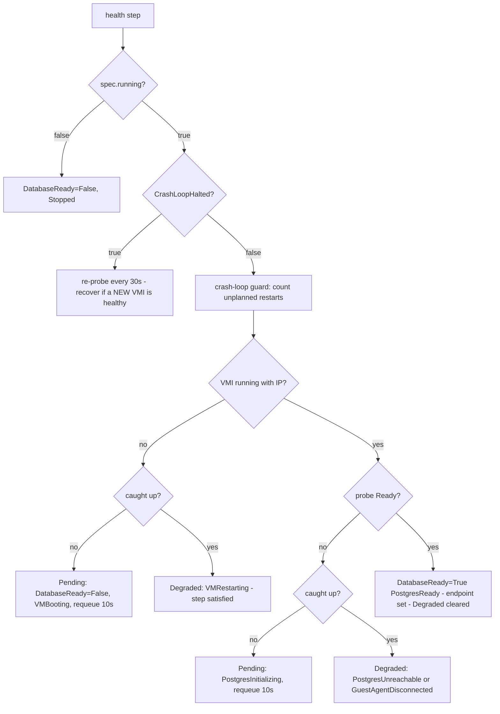

# Health checks

Health is observed from the Kubernetes and KubeVirt objects of the VM, not from a connection made by the operator. The operator never logs in to PostgreSQL.

## What is checked

### The readiness probe

The VM carries a KubeVirt readiness probe that runs **inside the guest** through the QEMU guest agent:

```text
test -f /var/lib/dbaas/bootstrap-complete && pg_isready -h 127.0.0.1 -p <port> -U <masterUsername> -d postgres
```

Both halves are required. `pg_isready` alone is true before cloud-init has created the master role; the marker file is written by the bootstrap script only after the role and database SQL succeeded.

| Probe setting | Value |
| --- | --- |
| `initialDelaySeconds` | 30 |
| `periodSeconds` | 10 |
| `timeoutSeconds` | 5 |
| `successThreshold` | 3 (about 30 s of passes before Ready returns) |
| `failureThreshold` | 12 (about 2 minutes of failures before Ready flips false) |

This probe is the single debounce. The controller adds no extra counting on top of it. A guest-agent disconnect also fails the probe, because the probe executes through the agent.

### What the health step reads

One observation of the VirtualMachineInstance per pass:

| Signal | Meaning |
| --- | --- |
| `Running` | A VMI exists and is running |
| `Ready` | The readiness probe is passing |
| `AgentConnected` | The guest agent is connected |
| `IP` | The data-network IP of the VM |
| `VMIUID` | The VMI UID, used to detect restarts |

The controller watches VMIs, so changes re-trigger a reconcile. A timer (every 10 s) covers windows without events.

## How readiness and phase are computed



"Caught up" means `status.observedGeneration == metadata.generation`.

- **While provisioning or applying a change** (not caught up), a failing check is a **gate**: the step returns Pending and the chain stops.
- **In steady state** (caught up), a failing check is **report-only**: `Degraded=True` is set with an attributed reason, `DatabaseReady=False`, and the step returns satisfied so the pass finishes and `Ready` is re-derived. The controller never restarts a VM because a readiness probe fails.

Degraded reasons:

| Reason | Cause |
| --- | --- |
| `VMRestarting` | VMI not running (restarting or halted out of band) |
| `GuestAgentDisconnected` | Guest agent down, so health is unknown |
| `PostgresUnreachable` | Probe failing while the VMI and agent are fine |

A Warning event is emitted when entering Degraded or when the reason changes, not on every pass.

### Endpoint

When healthy, `status.endpoint` is set to the VM's data-network IP, the port, and a JDBC URL with `ssl=true&sslmode=verify-ca`. The address is refreshed on every healthy pass, because it can change after a restart or live migration. See [connecting](/connecting).

### Aggregate Ready and phase

`Ready` is derived on every pass, whatever step the chain stopped at:

1. Instance is being deleted: `Ready=False`, reason `Deleting`.
2. `spec.running=false`: `Ready=False`, reason `Stopped`.
3. `DatabaseReady` is not `True`: `Ready=False`, carrying the `DatabaseReady` reason and message (or `Provisioning` if unknown).
4. `MonitoringReady` is not `True`: `Ready=False`, carrying its reason.
5. Otherwise `Ready=True`, reason `DBInstanceReady`.

`DatabaseReady` reports only PostgreSQL availability; `Ready` additionally requires monitoring. `Ready` ignores spec-validation conditions, so a rejected edit does not make a healthy database not Ready; the `Accepted` condition and phase report the rejection.

`status.phase` is a projection of conditions, evaluated in this order (first match wins):

| Phase | When |
| --- | --- |
| `deleting` | Deletion timestamp set |
| `crash-loop-halted` | `CrashLoopHalted=True` |
| `incompatible-parameters` | `Accepted=False` for the current generation |
| `stopping` / `stopped` | `running=false` with `PowerStateReady` false / true |
| `degraded` | `Degraded=True` |
| `modifying` | `ResizeInProgress` or `RepaveInProgress` is true |
| `degraded` | Database ready but monitoring deployment failed |
| `starting` | Power starting, or `Ready=False` after the first generation |
| `available` | `Ready=True` |
| `creating` | Anything else (initial provisioning) |

Phase never gates reconciliation.

## Crash-loop protection

Under the `Always` run strategy KubeVirt recreates the VMI after every guest exit. A crash-looping VM would otherwise restart forever.

- An **unplanned restart** is a VMI UID change (live migration keeps the UID, so it does not count). Planned starts reset the baseline.
- Each unplanned restart increments `status.restartCount` (observability only) and extends a chain in `status.recentUnplannedRestarts` if it happened within **10 minutes** of the previous one; a longer gap restarts the chain at 1.
- At **3** chained restarts the controller halts the VM, annotates the VM with `dbaas.opencloud.wso2.com/crash-loop-halted-vmi-uid`, and sets `CrashLoopHalted=True` (`CrashLoopDetected`), `DatabaseReady=False`, `InterventionRequired=True`. Phase is `crash-loop-halted`.
- While halted, the power step refuses to start the VM even if `spec.running` is true, and the health step re-probes every 30 s.
- **Recovery:** repair the cause and start the VM out of band (for example start it in Harvester). When a VMI with a new UID is running, ready, has the guest agent connected and an IP, the controller clears the halt, resets the chain, and emits a `Recovered` event.

```bash
kubectl get dbinstance mydb -o jsonpath='{.status.conditions[?(@.type=="CrashLoopHalted")].message}{"\n"}'
kubectl get dbinstance mydb -o jsonpath='{.status.restartCount} {.status.recentUnplannedRestarts}{"\n"}'
```

## How to check health

```bash
kubectl get dbinstance mydb
kubectl wait dbinstance/mydb --for=condition=Ready --timeout=10m
kubectl get dbinstance mydb -o jsonpath='{range .status.conditions[*]}{.type}={.status} {.reason}: {.message}{"\n"}{end}'
kubectl get events --field-selector involvedObject.name=mydb
```

## What to observe

| Field | Healthy value |
| --- | --- |
| `status.phase` | `available` |
| `DatabaseReady` | `True`, reason `PostgresReady` |
| `Ready` | `True`, reason `DBInstanceReady` |
| `Degraded` | absent |
| `CrashLoopHalted` | absent |
| `InterventionRequired` | `False` (`NoInterventionRequired`) |
| `status.endpoint.address` | VM data-network IP |
| `status.observedGeneration` | equals `metadata.generation` |

For metrics and dashboards see [monitoring](/monitoring). For failure diagnosis see [troubleshooting](/troubleshooting).

:::info Verified against
- `database/internal/ensure/health.go`
- `database/internal/ensure/power.go`
- `database/internal/ensure/monitoring.go`
- `database/internal/ensure/generation.go`
- `database/internal/controller/status_ready.go`
- `database/internal/controller/status_conditions.go`
- `database/internal/harvester/typed_client.go` (readiness probe in `buildPostgresVM`, `GetVMIReadiness`, `StopVMForCrashLoop`)
- `database/api/v1alpha1/dbinstance_conditions.go` (`DerivePhaseSummary`)
:::
