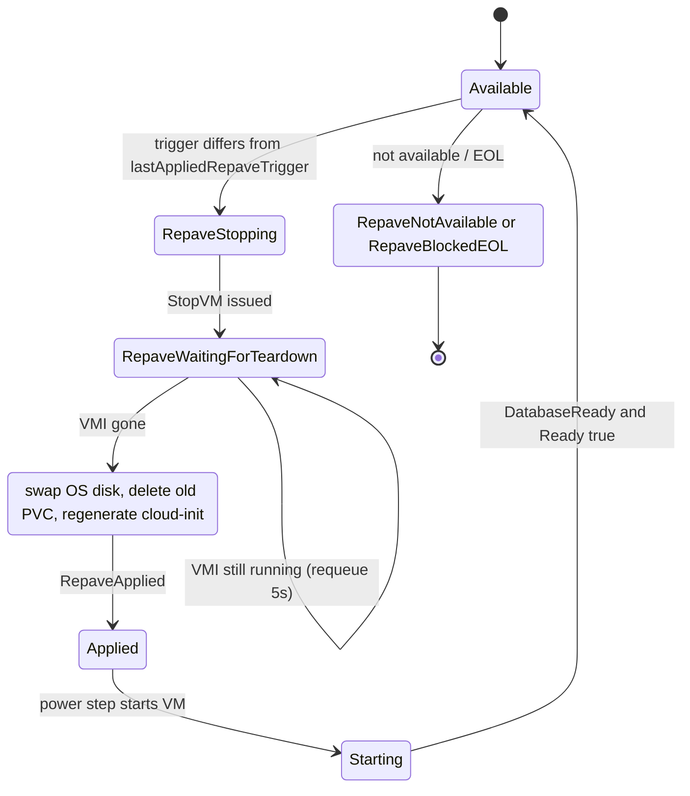

# Images and repave

Every DBInstance VM boots from a **baked image**: an Ubuntu VM image with all supported PostgreSQL major versions pre-installed. The operator carries a compiled-in **image catalog**. A **repave** swaps a running instance's OS disk onto the catalog's current image revision while keeping the data disk.

## Image catalog

The catalog lives in `internal/catalog/baked_images.go` and is compiled into the operator binary. It can only change by shipping a new operator build. It has two maps.

| Map | Key | Meaning |
| --- | --- | --- |
| `BakedImages` | revision name | One built image: Harvester image name, OS version, supported PostgreSQL majors, default major |
| `LatestBakedImages` | OS stream (for example `24.04`) | The active revision for that stream and its validation state |

Registered revisions in v0.1.0:

| Revision | OS | Supported engine versions | Default |
| --- | --- | --- | --- |
| `ubuntu-2204-postgres-v20260515` | 22.04 | 15, 16, 17 | 17 |
| `ubuntu-2404-postgres-v20260701` | 24.04 | 15, 16, 17, 18 | 17 |
| `ubuntu-2404-postgres-v20260815` | 24.04 | 18 | 18 |

The third revision is registered but not active: it simulates a PostgreSQL major going end-of-life and is not referenced by `LatestBakedImages`.

Active streams in v0.1.0:

| Stream | Active revision | Validation state |
| --- | --- | --- |
| `22.04` | `ubuntu-2204-postgres-v20260515` | `Validated` |
| `24.04` | `ubuntu-2404-postgres-v20260701` | `Validated` |

Only a stream whose state is `Validated` is ever used. `Pending` means "not safe to use yet"; a stream that is `Pending`, unknown, or points at a missing revision is treated as unresolvable.

## How an image is chosen

There is no per-instance image field on the DBInstance. The choice is made in two steps.

1. **OS stream** comes from the platform-wide operator setting `databaseDefaults.osVersion` (default `22.04`). See [operator configuration](/configuration/operator-config).
2. **PostgreSQL major** comes from `spec.engineVersion`. If it is unset, the revision's `DefaultEngineVersion` is used. If it is set, it must be in the revision's supported list.

The resolved image name is looked up in Harvester (by name or display name). The image must be imported and ready.

### Preflight outcomes (new instances only)

These checks run only before the VM is first created (`status.appliedSpec` is unset). Once a VM exists, a catalog change never fails a running instance.

| Situation | Condition | Reason | Result |
| --- | --- | --- | --- |
| Stream unknown or not `Validated` | `PreflightReady=False` | `OSImageInvalid` | Terminal |
| `engineVersion` not supported by revision | `PreflightReady=False` | `OSImageInvalid` | Terminal |
| Harvester image not found | `PreflightReady=False` | `OSImageNotFound` | Terminal |
| Image ambiguous or reference invalid | `PreflightReady=False` | `OSImageInvalid` | Terminal |
| Image still importing | `PreflightReady=Unknown` | `OSImageNotReady` | Retry every 10 s |

`engineVersion` is immutable after creation. At boot, the cloud-init script drops the throwaway clusters created at package-install time and creates a cluster for the requested version, unless `/var/lib/postgresql` is already the mounted data disk (in which case it never drops clusters).

## Drift detection

Every reconcile, if a stream is resolvable, the operator compares `status.currentImageRevision` with the stream's active revision and writes the `ImageDrift` condition. It is report-only and three-valued.

| Status | Reason | Meaning |
| --- | --- | --- |
| `False` | `ImageUpToDate` | VM is on the active revision |
| `True` | `OSUpdateAvailable` | Newer revision available and your `engineVersion` is supported in it. Safe to repave |
| `True` | `EngineVersionEOL` | Newer revision exists but does not support your `engineVersion`. Repave is blocked |
| `Unknown` | `ImageCatalogUnresolved` | No validated stream for `databaseDefaults.osVersion`; drift cannot be evaluated |
| `Unknown` | `CurrentImageRevisionUnknown` | Current revision not observed yet |

`currentImageRevision` is also self-healed each pass from the VM's real OS-disk image, so a lost status write does not leave it stale.

```bash
kubectl get dbinstance mydb
# NAME   PHASE       CLASS          ENDPOINT      IMAGEDRIFT   AGE
# mydb   available   db.t3.medium   10.0.40.12    True         12d

kubectl get dbinstance mydb -o jsonpath='{.status.conditions[?(@.type=="ImageDrift")]}'
```

`kubectl get dbi -o wide` also shows the `ImageDriftReason` column.

## How to trigger a repave

A repave starts when the annotation `dbaas.opencloud.wso2.com/repave-trigger` has a value different from `status.lastAppliedRepaveTrigger`. The controller never modifies or clears the annotation (Flux `requestedAt` style). Use a fresh value each time, for example a timestamp.

```bash
kubectl annotate dbinstance mydb \
  dbaas.opencloud.wso2.com/repave-trigger="$(date -u +%Y-%m-%dT%H:%M:%SZ)" --overwrite

# Watch it
kubectl get dbinstance mydb -w
kubectl get dbinstance mydb -o jsonpath='{.status.currentImageRevision}{"\n"}{.status.lastAppliedRepaveTrigger}{"\n"}'
```

### Preconditions

- The instance must be in phase `available`. Otherwise the trigger is consumed and rejected with `RepaveNotAvailable`.
- `spec.engineVersion` (or the revision default when unset) must be supported by the target revision. Otherwise the trigger is consumed and rejected with `RepaveBlockedEOL`.
- If the VM already runs the active revision, the trigger is consumed and nothing happens.
- If the stream is unresolvable, the step does nothing and the trigger is left unexamined until the catalog resolves.

A rejected trigger is recorded in `status.lastAppliedRepaveTrigger`, so you must set a new value to retry.

## Repave phases



1. **Stopping** (`RepaveStopping`). `RepaveInProgress=True`, the VM `runStrategy` is set to Halted, `DatabaseReady=False`. Phase becomes `modifying`.
2. **Waiting for teardown** (`RepaveWaitingForTeardown`). The step requeues every 5 s until the VMI is gone.
3. **Swap and apply** (`RepaveApplied`). In one pass:
   - the VM's `os-disk` claim is repointed to a new PVC named `pg-<name>-<uid8>-os-<image-object-name>`, created by Harvester from the new image;
   - the old OS PVC name is written to `status.resources.pendingDeleteOSDiskPVCName`, the PVC is deleted, then the field is cleared. If the process is interrupted, the next reconcile retries the delete first;
   - `status.resources.osDiskPVCName` and `status.currentImageRevision` are updated, and `ImageDrift` is set to `False / ImageUpToDate`;
   - the cloud-init Secret is regenerated from the stored credentials and the resolved engine version;
   - `status.lastAppliedRepaveTrigger` is set to the annotation value.
4. **Restart.** The power step sees "desired running, declared Halted" and starts the VM. Cloud-init runs on the fresh OS disk.
5. **Settle.** `RepaveInProgress` is removed only when `ImageDrift` is no longer `True` and the instance is `Ready` for the current generation. Phase returns to `available`.

While a repave is in flight the instance reports phase `modifying`.

## Data preservation

- The **data disk** (`pg-<name>-<uid8>-data`, mounted at `/var/lib/postgresql`) is not touched. Only the OS disk is replaced.
- On the new OS disk, the bootstrap script detects the existing data disk (filesystem present, `PG_VERSION` marker present) and keeps it. It never runs `mkfs` on a formatted disk and never copies the throwaway cluster over existing data.
- The bootstrap script checks whether the master role already exists on the data disk (`ROLE_EXISTED`) before running its role setup, and the credentials are rebuilt from the same durable Secrets, not regenerated. See [credentials](/security/credentials).
- The `engineVersion` does not change during a repave. The new image must support the same major.

See [storage](/operations/storage) for the disk layout.

## Rollback and abort

There is no rollback or abort command. Specifically:

- The old OS PVC is deleted as part of the swap, so the previous image cannot be restored by the operator.
- Removing or changing the annotation does not stop an in-flight repave; the controller only compares it to `status.lastAppliedRepaveTrigger`.
- Before the swap, the trigger has not been recorded yet, so a transient failure (for example a Harvester API error) is simply retried on the next reconcile; the VM stays halted until the swap completes or the instance is otherwise changed.
- To recover from a bad image, ship an operator build whose catalog points the stream at a good revision and trigger another repave.

## What to observe

| Where | Field | Values during a repave |
| --- | --- | --- |
| `status.phase` | | `available`, then `modifying`, then `starting`, then `available` |
| Condition `RepaveInProgress` | `reason` | `RepaveStopping`, `RepaveWaitingForTeardown`, `RepaveApplied` |
| Condition `ImageDrift` | `status` | `True` before, `False` after the swap |
| Condition `DatabaseReady` | | `False` with the repave reason until PostgreSQL is back |
| `status.currentImageRevision` | | Old revision, then new revision |
| `status.lastAppliedRepaveTrigger` | | Set to the annotation value once processed |
| `status.resources.osDiskPVCName` | | New `-os-<image>` name |
| `status.resources.pendingDeleteOSDiskPVCName` | | Briefly set, then empty |

When the repave is rejected, `RepaveInProgress` is `False` with reason `RepaveNotAvailable` or `RepaveBlockedEOL`. Full condition reference: [status and conditions](/reference/status-and-conditions).

:::info Verified against
- `database/internal/catalog/baked_images.go`
- `database/internal/ensure/repave.go`
- `database/internal/ensure/defaults.go`
- `database/internal/ensure/preflight.go`
- `database/internal/ensure/vm.go`
- `database/internal/harvester/typed_client.go` (`SwapVMOSDisk`, `DeletePVC`)
- `database/internal/controller/status_conditions.go`
- `database/internal/credentials/cloudinit.go`
- `database/internal/config/defaults.go`
- `database/api/v1alpha1/dbinstance_types.go`
- `database/api/v1alpha1/dbinstance_conditions.go`
:::
