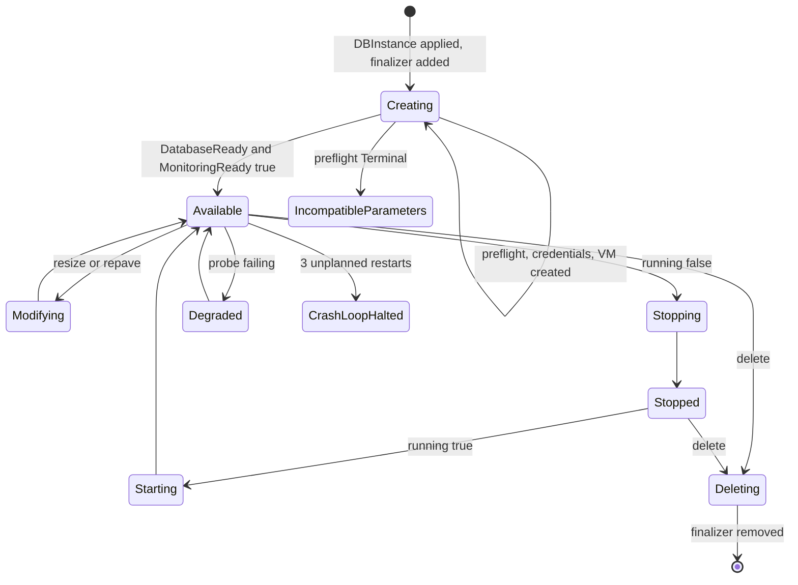
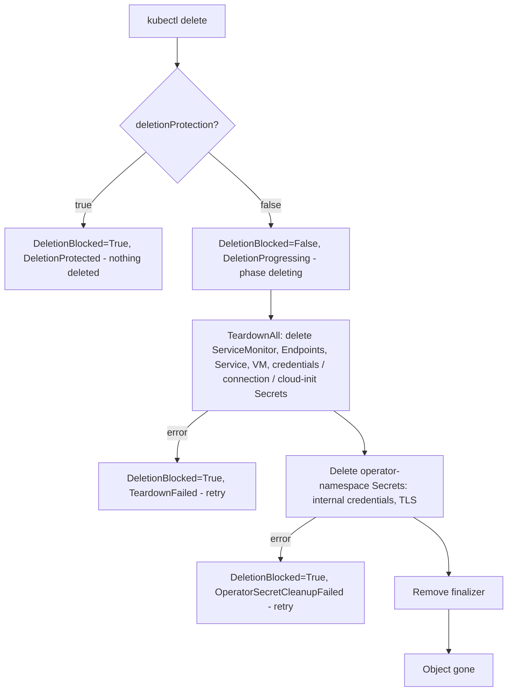

# Lifecycle and deletion

## Create to available

On every reconcile the operator runs the same ordered chain of steps. A step either is satisfied (continue), pending (stop and wait for an event or a timer), terminal (stop, needs a spec change), or transient (stop, retry with backoff). There is no separate code path for provisioning versus steady state.

| Order | Step | What it does |
| --- | --- | --- |
| 1 | preflight | Validates class, `networkRef`, immutable fields, the VM-password policy, and (for new instances) the image and engine version |
| 2 | credentials | Resolves or generates the master password and creates the durable Secrets |
| 3 | vm | Creates cloud-init Secret and the VirtualMachine; records `appliedSpec` and `currentImageRevision` |
| 4 | resize | Converges CPU, memory and disk size |
| 5 | repave | Reports image drift; runs a repave when triggered |
| 6 | power | Converges VM power onto `spec.running` |
| 7 | health | Gates readiness, tracks restarts, sets the endpoint |
| 8 | connection-secret | Maintains the tenant connection Secret |
| 9 | monitoring | Deploys metrics Service and ServiceMonitor |
| 10 | bootstrap-cleanup | Redacts cloud-init user data once the database is up |
| 11 | generation-reconciled | Records `observedGeneration` once every earlier step is satisfied |

The first reconcile only adds the finalizer and returns; the update event triggers the next pass.



Phases are derived from conditions every pass; they never gate reconciliation. See [status and conditions](/reference/status-and-conditions) for the full list.

### Typical timeline of conditions

1. `PreflightReady=True` (`PreflightPassed`), `Accepted=True`.
2. `CredentialsReady=True`.
3. `VMReady`: `False / VMCreated` then `True / VMPresent`.
4. `PowerStateReady`: `Starting` then `Running`.
5. `DatabaseReady`: `VMBooting`, then `PostgresInitializing`, then `True / PostgresReady`. `status.endpoint` is filled.
6. `MonitoringReady=True`, then `Ready=True` (`DBInstanceReady`), phase `available`.
7. `status.observedGeneration` equals `metadata.generation`.

### How to create and observe

```yaml
apiVersion: dbaas.opencloud.wso2.com/v1alpha1
kind: DBInstance
metadata:
  name: mydb
spec:
  dbInstanceClass: db.t3.medium
  allocatedStorage: 50
  engineVersion: "16"
  dbName: myapp
  masterUsername: dbadmin
  networkRef: default/vm-net-100
  deletionProtection: true
  running: true
```

```bash
kubectl apply -f mydb.yaml
kubectl wait dbinstance/mydb --for=condition=Ready --timeout=20m
kubectl get dbinstance mydb
```

## Bootstrap cleanup

The cloud-init Secret contains sensitive bootstrap data. Once `DatabaseReady=True`, the bootstrap-cleanup step rewrites the Secret's user data to a minimal no-op (`#cloud-config` with an empty map) and keeps the network data. The Secret object itself is **not** deleted, because the running VMI keeps it mounted as a volume. The VM is not touched. The step defers while the database is not ready (booting, stopped, degraded), and it stops the pass once after a change so the next reconcile re-observes the redaction (reason `BootstrapCleanupReconciled`).

A repave regenerates the full user data and the step redacts it again after the database is back up.

## Deletion

```bash
kubectl delete dbinstance mydb
```

The operator adds the finalizer `dbaas.opencloud.wso2.com/cleanup` before creating any child resource, so deletion always goes through teardown.



### Deletion protection

With `spec.deletionProtection: true` (phase shows `deleting` with the blocked message), the delete request is accepted by the API server (the object gets a deletion timestamp) but the finalizer refuses teardown: `DeletionBlocked=True`, reason `DeletionProtected`. Nothing is deleted. To proceed, set `deletionProtection` to false; the pending deletion then continues.

```bash
kubectl patch dbinstance mydb --type merge -p '{"spec":{"deletionProtection":false}}'
```

### What teardown deletes

Teardown runs the deletes in parallel; a missing object counts as success, and any other error is aggregated and retried.

| Resource | Source of the name |
| --- | --- |
| ServiceMonitor, metrics Endpoints and Service | `status.resources.serviceMonitor`, `metricsServiceName` |
| VirtualMachine | `status.resources.vmName` |
| Tenant credentials Secret | `status.resources.adminCredentialsSecretName` |
| Connection Secret | `status.resources.connectionSecretName` |
| Cloud-init Secret | `status.resources.cloudInitSecretName` |
| Internal credentials and TLS Secrets (operator namespace) | `status.resources.internalSecretRef`, `privateTLSSecretRef`, plus a sweep by label `dbaas.opencloud.wso2.com/dbinstance-uid` as a backstop |

A user-provided password Secret (`spec.credentials`) is never modified or deleted by DBaaS.

### PVC retention

The teardown code **does not delete the data or OS PVCs explicitly**. It deletes the VirtualMachine, and what happens to the PVCs then is decided by Harvester and the StorageClass reclaim policy, not by operator code. Treat the disks as not guaranteed to be removed, and verify with `kubectl get pvc` after a delete. If you need the data kept for sure, use a StorageClass with reclaim policy `Retain`.

Because disk names embed the instance UID, re-applying a DBInstance with the same name after deletion creates new, different PVC names and never silently reattaches a leftover disk. A leftover disk must be cleaned up by hand.

The only PVC the operator deletes itself is the old OS disk after a repave. See [images and repave](/operations/images-and-repave).

### Observe

```bash
kubectl get dbinstance mydb -o jsonpath='{.status.phase}{"\n"}'
kubectl get events --field-selector involvedObject.name=mydb
kubectl get dbinstance mydb -o jsonpath='{.status.conditions[?(@.type=="DeletionBlocked")]}'
```

Events: `DeletionProgressing` (Normal) when teardown starts; `TeardownFailed` and `OperatorSecretCleanupFailed` (Warning) on errors. `Ready` is `False` with reason `Deleting`.

:::info Verified against
- `database/internal/controller/dbinstance_controller.go` (`Reconcile`, `reconcileDelete`, `deleteOperatorSecrets`)
- `database/internal/ensure/runner.go`
- `database/internal/ensure/bootstrap_cleanup.go`
- `database/internal/ensure/vm.go`
- `database/internal/harvester/typed_client.go` (`TeardownAll`)
- `database/internal/controller/status_ready.go`
- `database/api/v1alpha1/dbinstance_conditions.go`
- `database/api/v1alpha1/dbinstance_types.go`
- `database/config/samples/dbaas_v1alpha1_dbinstance.yaml`
:::
