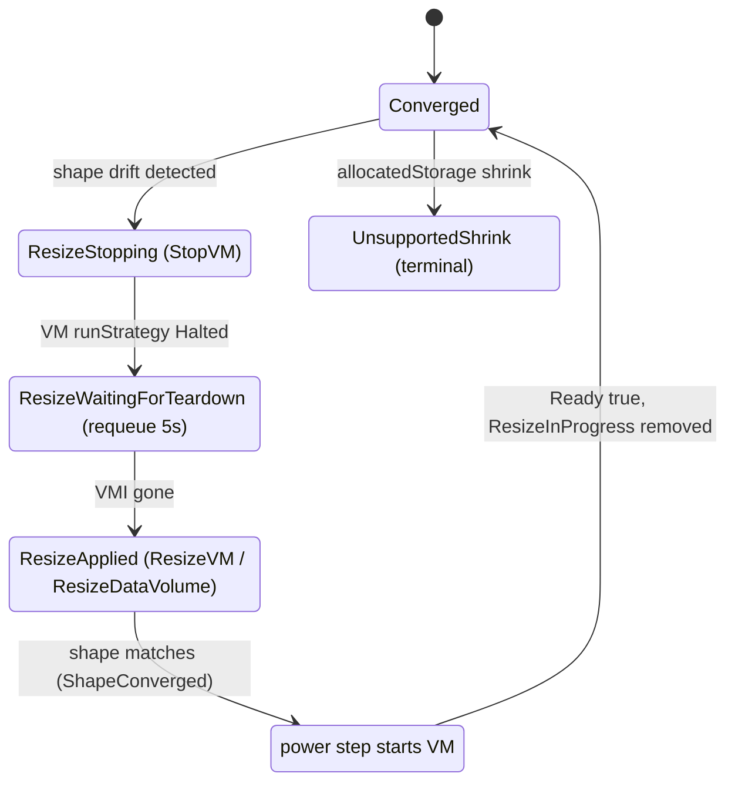
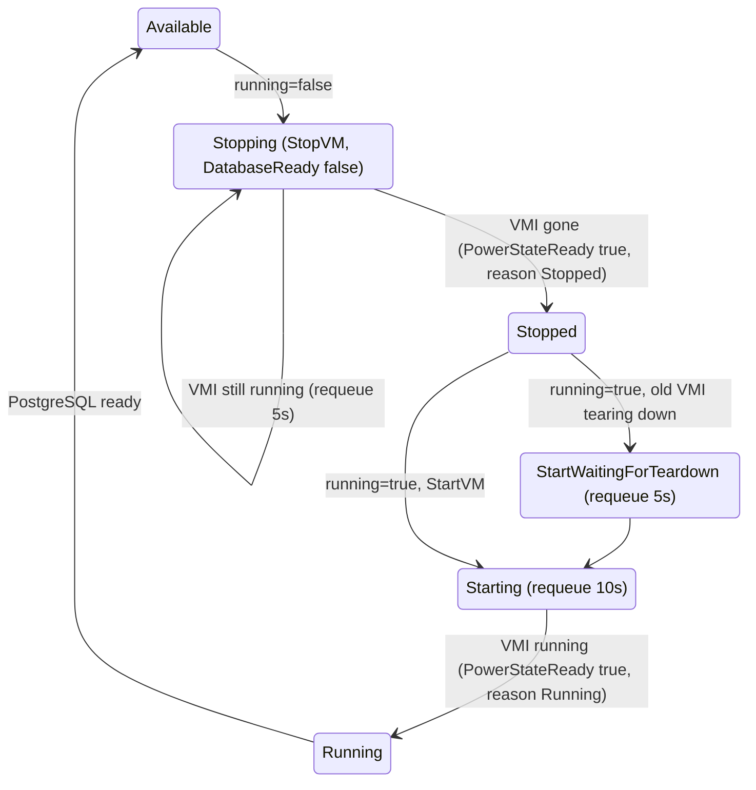

# Resize and power

CPU, memory and disk size are changed by editing `spec.dbInstanceClass` and `spec.allocatedStorage`. Power is controlled by `spec.running`. All three are mutable after creation.

## Resize

### What is allowed

| Change | Allowed | Notes |
| --- | --- | --- |
| `dbInstanceClass` to any known class (up or down) | Yes | Sets VM CPU cores and memory |
| `allocatedStorage` larger | Yes | Grows the data disk |
| `allocatedStorage` smaller | No | Rejected, see below |
| `storageType` | No | Immutable, see [storage](/operations/storage) |

Unknown classes are rejected by preflight with `InvalidClass`. Supported classes (CPU cores / memory):

| Class | CPU | Memory |
| --- | --- | --- |
| `db.t3.micro` | 1 | 1024 MiB |
| `db.t3.small` | 1 | 2048 MiB |
| `db.t3.medium` | 2 | 4096 MiB |
| `db.t3.large` | 2 | 8192 MiB |
| `db.t3.xlarge` | 4 | 16384 MiB |
| `db.m5.large` | 2 | 8192 MiB |
| `db.m5.xlarge` | 4 | 16384 MiB |
| `db.m5.2xlarge` | 8 | 32768 MiB |
| `db.m5.4xlarge` | 16 | 65536 MiB |
| `db.r5.large` | 2 | 16384 MiB |
| `db.r5.xlarge` | 4 | 32768 MiB |
| `db.r5.2xlarge` | 8 | 65536 MiB |

The operator-configured class table (see [operator configuration](/configuration/operator-config)) is what is enforced at runtime; the table above is the built-in catalog in the API package.

### Offline only (cold resize)

Every resize is a **cold resize**: the VM is stopped, the shape is changed, and the VM is started again. There is no online resize. Expect downtime for the whole stop, apply and boot cycle. The resize is intentional, so a `Degraded` condition is cleared while it runs and the phase is `modifying`.



1. **Detect.** The step compares the VM's CPU and memory limits with the class, and the data PVC's requested size (from the `harvesterhci.io/volumeClaimTemplates` annotation) with `spec.allocatedStorage`.
2. **Stop** (`ResizeStopping`). VM set to Halted. `StorageReady=False`, `DatabaseReady=False`, `ResizeInProgress=True`.
3. **Wait** (`ResizeWaitingForTeardown`). Requeue every 5 s while the VMI is running.
4. **Apply** (`ResizeApplied`). `ResizeVM` sets CPU cores and memory limits; `ResizeDataVolume` raises the data volume claim size. Both are idempotent, so a crash between them is safe.
5. **Converge.** On the next pass the shape matches: `StorageReady=True` (`ShapeConverged`). The power step restarts the VM.
6. **Settle.** `ResizeInProgress` is removed only when `StorageReady` is true for the current generation and the instance is `Ready` (or, if stopped, `PowerStateReady`). A stopped instance can also be resized; the new shape takes effect on the next start.

Disk growth relies on Harvester expanding the live PVC from the annotation. The data volume request is written only when it exceeds the current size.

### Shrink is rejected

A request smaller than the provisioned size sets:

- `StorageChangeRejected=True` with reason `UnsupportedShrink`
- `Accepted=False`, phase `incompatible-parameters`
- `StorageReady=Unknown`

The running database is unaffected. Revert `allocatedStorage` and the rejection condition is removed. In addition, the CRD carries a CEL rule (`self >= oldSelf`) that refuses shrinking at apply time.

### How to trigger a resize

```bash
# CPU and memory: change the class
kubectl patch dbinstance mydb --type merge -p '{"spec":{"dbInstanceClass":"db.m5.large"}}'

# Disk: grow only
kubectl patch dbinstance mydb --type merge -p '{"spec":{"allocatedStorage":100}}'

# Watch
kubectl get dbinstance mydb -w
kubectl get dbinstance mydb -o jsonpath='{range .status.conditions[*]}{.type}={.status} ({.reason}){"\n"}{end}'
```

### What to observe

| Field | During resize |
| --- | --- |
| `status.phase` | `modifying`, then `starting`, then `available` |
| `ResizeInProgress` | `True` with `ResizeStopping`, `ResizeWaitingForTeardown`, `ResizeApplied`; removed when settled |
| `StorageReady` | `False` during, `True` (`ShapeConverged`) after |
| `DatabaseReady` / `Ready` | `False` during, `True` after boot |
| `status.observedGeneration` | Catches up to `metadata.generation` |

## Power on and off

`spec.running` defaults to `true`. Set it to `false` to stop the VM; storage is preserved.

### How to trigger

```bash
# Stop
kubectl patch dbinstance mydb --type merge -p '{"spec":{"running":false}}'

# Start
kubectl patch dbinstance mydb --type merge -p '{"spec":{"running":true}}'
```

### Power state machine

The power step observes two layers: the declared layer (`runStrategy` on the VM, `Always` means running) and the runtime layer (whether a VMI exists). It converges both onto `spec.running`.



| Phase (`status.phase`) | Condition detail |
| --- | --- |
| `stopping` | `spec.running=false`, `PowerStateReady=False` reason `Stopping` |
| `stopped` | `PowerStateReady=True` reason `Stopped`; message "Stopped. Storage preserved."; `Ready=False` reason `Stopped` |
| `starting` | `PowerStateReady=False` reason `StartWaitingForTeardown` or `Starting`, then `Ready` still false until PostgreSQL passes its readiness probe |
| `available` | `Ready=True` |

Behaviour details:

- A **planned start** resets `lastKnownVMIUID`, `recentUnplannedRestarts` and `lastUnplannedRestartTime`, so a deliberate start is never counted as a crash. See [health checks](/operations/health-checks).
- A stopped instance is not "degraded": the `Degraded` condition is cleared once the VM is fully stopped.
- While `CrashLoopHalted` is true, power management is suspended: `PowerStateReady=False` reason `CrashLoopHalted`, and `spec.running=true` will not restart the VM. Recovery is done by starting the VM out of band; see [health checks](/operations/health-checks).
- An instance with `spec.running=false` cannot be repaved (repave requires phase `available`).

### Hibernation

There is no separate hibernate feature or memory-state snapshot. `running: false` is a full VM stop (cold power off) with the OS and data disks retained. Starting boots the VM again. It is the closest equivalent to declarative hibernation.

:::info Verified against
- `database/internal/ensure/resize.go`
- `database/internal/ensure/power.go`
- `database/internal/ensure/health.go`
- `database/internal/controller/status_conditions.go`
- `database/internal/controller/status_ready.go`
- `database/internal/harvester/typed_client.go` (`ResizeVM`, `ResizeDataVolume`, `StopVM`, `StartVM`)
- `database/api/v1alpha1/dbinstance_types.go` (`InstanceClasses`, `allocatedStorage` CEL rule, `running`)
- `database/api/v1alpha1/dbinstance_conditions.go` (`DerivePhaseSummary`)
- `database/internal/config/defaults.go`, `database/internal/config/types.go`
:::
