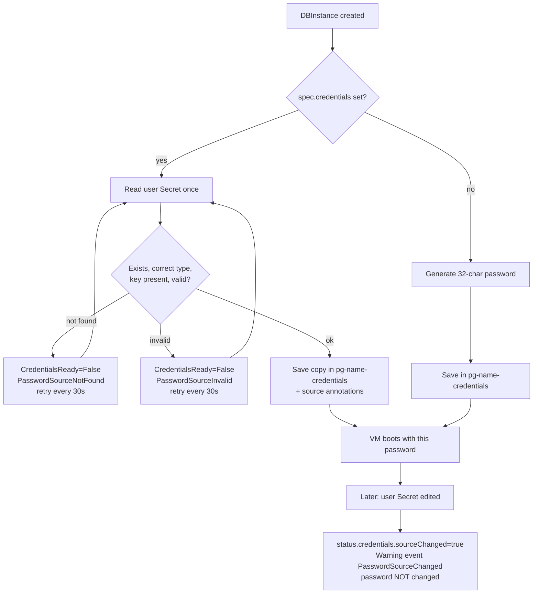

# Credentials

Every `DBInstance` has one **master user** (default `dbadmin`, set with `spec.masterUsername`) and one **master password**. You can let the operator generate the password or supply your own.

## Generated or bring-your-own

| | Generated (default) | Bring your own (BYO) |
| --- | --- | --- |
| How | Omit `spec.credentials` | Set `spec.credentials.passwordSource.secretRef` |
| Who picks the password | The operator: 32 random URL-safe characters | You |
| Where to read it | `pg-<name>-credentials` | Your Secret, or the saved copy `pg-<name>-credentials` |

In both cases the password the database actually uses is in the Secret `pg-<name>-credentials` (keys `admin_user` and `admin_password`):

```sh
kubectl get secret pg-orders-db-credentials -n tenant-acme -o jsonpath='{.data.admin_user}' | base64 -d; echo
kubectl get secret pg-orders-db-credentials -n tenant-acme -o jsonpath='{.data.admin_password}' | base64 -d; echo
```

## Using your own password

The Secret must live in the **same namespace** as the `DBInstance` and must have the type `dbaas.opencloud.wso2.com/master-password`:

```sh
printf '%s' 'S0me-long-passw0rd' > password.txt   # printf, not echo: no trailing newline
kubectl create secret generic orders-db-password -n tenant-acme \
  --type=dbaas.opencloud.wso2.com/master-password \
  --from-file=password=./password.txt
```

Then reference it:

```yaml
apiVersion: dbaas.opencloud.wso2.com/v1alpha1
kind: DBInstance
metadata:
  name: orders-db
  namespace: tenant-acme
spec:
  dbInstanceClass: db.t3.small   # use a class from your catalog
  networkRef: iaas-net/vm-subnet-001
  masterUsername: appowner
  credentials:
    passwordSource:
      secretRef:
        name: orders-db-password
        key: password
```

:::note
The Secret type is a guardrail against pointing at the wrong Secret (for example a TLS key). It is not access control: anyone who can write a Secret can set its type. RBAC decides who may reference what.
:::

### Validation rules

A violation is reported on the `CredentialsReady` condition (see below), and nothing is created for the instance until it is fixed.

- The Secret is looked up only in the instance's own namespace. `secretRef` has just `name` and `key`, so one tenant cannot reference another tenant's Secret.
- The password must be valid UTF-8, contain no NUL byte and no CR or LF, and be **8 to 128 bytes** long.
- `masterUsername` may not be `postgres`, `postgres_exporter`, `replicator`, `repl`, `public` or `none`, and may not start with `pg_` (case-insensitive). This check applies to BYO instances.
- **Name clash:** the Secret may not be named `pg-<name>-credentials`, `pg-<name>-connect` or `pg-<name>-cloudinit`. The operator creates and deletes Secrets with those names, so a clash would either be mistaken for its own saved copy or be deleted with the instance.
- `spec.credentials` is immutable after creation (it cannot be added, changed or removed) and cannot be combined with `manageMasterUserPassword` or `masterUserPasswordRef`. Those two older fields are reserved and not implemented.

## Lifecycle



- **Your Secret is read once.** The operator keeps its own copy in `pg-<name>-credentials`; retries and repaves use that copy, never your Secret again.
- **Editing your Secret later does not change the database password.** The instance sets `status.credentials.sourceChanged: true` and emits one Warning event, `PasswordSourceChanged`. "Changed" means the Secret object changed (UID or `resourceVersion` differs, so a label edit counts too). The check runs at the instance's next reconcile; nothing watches your Secret. Any change to the `DBInstance` triggers one, even an annotation.
- **Deleting your Secret later changes nothing** and is not reported.
- **No in-place rotation.** The operator has no implementation for changing the password of a running database. A password changed inside PostgreSQL (`ALTER ROLE`) is invisible to the operator; update `admin_password` in `pg-<name>-credentials` yourself so the record stays true.
- **A repave keeps the password.** The data disk keeps its roles, and bootstrap only creates the master role when it does not already exist.
- **Durable material is never regenerated.** If `pg-<name>-credentials` (or one of the two operator-namespace Secrets below) goes missing after the VM was created, the operator refuses to generate a replacement because it would not match the running database. See `CredentialsLost` below.

The BYO source Secret is never modified or deleted by the operator, including when the instance is deleted.

## Secrets created per instance

| Secret | Namespace | Holds |
| --- | --- | --- |
| `pg-<name>-credentials` | tenant | `admin_user`, `admin_password` (the saved copy) |
| `pg-<name>-connect` | tenant | `host`, `port`, `dbname`, `jdbcUrl`, `sslmode`, `ca.crt`. No password. See [Connecting](/connecting) |
| `pg-<name>-cloudinit` | tenant | First-boot data including passwords. The user data is replaced by an empty `#cloud-config` once `DatabaseReady` is true and the monitoring step has completed |
| `dbi-<uid>-internal` | operator namespace | `repl_password` (32 chars), `exporter_password` (24 chars) |
| `dbi-<uid>-tls` | operator namespace | `ca.crt`, `ca.key`, `tls.crt`, `tls.key` (type `kubernetes.io/tls`) |

The tenant credentials Secret is owned by the `DBInstance` (controller owner reference), type `Opaque`, labelled `dbaas.opencloud.wso2.com/instance`. For a BYO instance it also carries the annotations `dbaas.opencloud.wso2.com/password-source-secret`, `...-uid` and `...-resource-version`, which never contain the password. A credentials Secret without them is reported as `Generated`.

The two `dbi-` Secrets are in the operator namespace and are not meant to be read by tenants; who can read them is decided by your RBAC.

## Reporting in status

```sh
kubectl get dbinstance orders-db -n tenant-acme -o jsonpath='{.status.credentials}{"\n"}'
kubectl get dbinstance orders-db -n tenant-acme \
  -o jsonpath='{.status.conditions[?(@.type=="CredentialsReady")]}{"\n"}'
```

`status.credentials` holds `source` (`Generated` or `UserProvidedSecret`), `sourceSecretName`, `sourceUID`, `sourceResourceVersion` and `sourceChanged`. It never holds the password. `status.resources` records `adminCredentialsSecretName`, `internalSecretRef` and `privateTLSSecretRef`.

| `CredentialsReady` | Meaning |
| --- | --- |
| `True`, `CredentialsProvisioned` | Credentials observed and consistent |
| `True`, `CredentialsCreated` | Just created; the operator waits about 5 seconds to re-observe them |
| `False`, `PasswordSourceNotFound` | Your Secret does not exist yet; nothing is created. Re-checked every 30 seconds |
| `False`, `PasswordSourceInvalid` | Wrong type, missing key, bad length or line break, reserved username, or reserved Secret name. The message never contains the password. Re-checked every 30 seconds |
| `False`, `CredentialsLost` | A durable Secret is missing for an already-provisioned instance. One Warning event on first occurrence; re-checked every 30 seconds |
| `False`, `CredentialsResolveFailed` | Any other (transient) error |

See [Status and conditions](/reference/status-and-conditions) for the full list.

## Recovering a lost password

| Situation | What to do |
| --- | --- |
| Forgot the password, instance fine | Read `pg-<name>-credentials` |
| Your Secret was edited or deleted | The database is unchanged; the password it uses is in `pg-<name>-credentials` |
| `pg-<name>-credentials` missing (`CredentialsLost`) | If you know the password, recreate it with keys `admin_user` and `admin_password`; the operator continues on its next poll. A hand-made Secret has no source annotations, so `source` reads `Generated`; the database is unaffected. Otherwise restore from a backup |
| `dbi-<uid>-internal` or `dbi-<uid>-tls` missing | A platform admin restores it from a cluster backup. The operator will not regenerate it, because a new CA or exporter password would not match the running VM |

If no copy of the password exists, it cannot be recovered; it can only be reset inside PostgreSQL, which needs a shell on the VM. That is only possible when the instance was created with `spec.vmPassword` (see [TLS and access](/security/tls-and-access)). There is no operator-driven password reset feature.

## Deleting an instance

Deletion removes the VM, the monitoring Service, Endpoints and ServiceMonitor, and the five Secrets above. Your own BYO Secret is kept; delete it yourself.

:::info Verified against
- `database/internal/credentials/resolver.go`
- `database/internal/credentials/passwordsource.go`
- `database/internal/credentials/material.go`
- `database/internal/ensure/credentials.go`
- `database/internal/ensure/bootstrap_cleanup.go`
- `database/internal/ensure/runner.go`
- `database/api/v1alpha1/dbinstance_types.go`
- `database/CREDENTIALS.md`
:::
